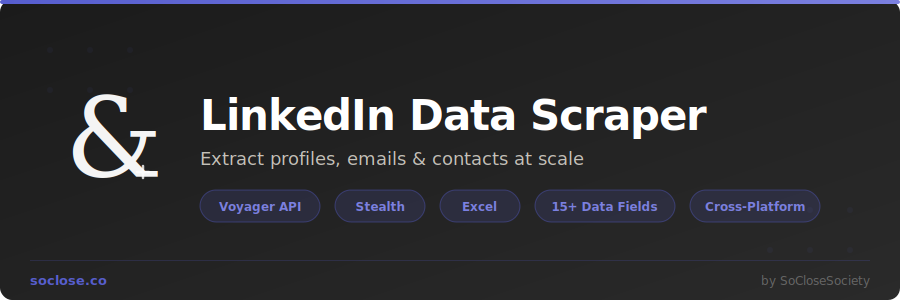

<div align="center">



<br/>
<br/>

[](https://www.python.org/downloads/)
[](LICENSE)
[]()
[](https://playwright.dev/)
[](https://streamlit.io/)
[](Dockerfile)

**Python tool to scrape LinkedIn search results and extract professional profile data.**<br>
Search by keywords, job title, location, and industry. Export to **Excel** (.xlsx) with color-coded formatting and **CSV**.

[Quick Start](#-quick-start) &bull; [CLI Usage](#-cli-usage) &bull; [Web UI](#-web-interface-streamlit) &bull; [Excel Output](#-excel-output-format) &bull; [Docker](#-docker-deployment)

---

</div>

## Why This Tool?

Most LinkedIn scrapers break constantly because they parse HTML that LinkedIn changes every week. **This scraper intercepts LinkedIn's internal Voyager API** to get structured JSON data directly — the same data LinkedIn's own frontend uses. When the API doesn't capture something, it falls back to DOM parsing.

**The result**: reliable data extraction that survives LinkedIn UI updates, with 15+ fields per profile including emails, phone numbers, experience, education, and skills.

---

## Features

| Feature | Description |
|---------|-------------|
| **People Search** | Search by keywords, name, job title, company, location, country, industry |
| **Profile Extraction** | Full name, headline, company, location, about, experience, education, skills, connections |
| **Contact Info** | Email, phone, website — when publicly visible on the profile |
| **Excel Export** | Color-coded headers, clickable links, auto-filters, frozen headers, email highlighting |
| **CSV Export** | Clean UTF-8 CSV for CRM, mail merge, Google Sheets |
| **Anti-Detection** | Playwright stealth, randomized delays, cookie sessions, adaptive rate limiting |
| **Rich CLI** | Progress bars, colored output, interactive prompts |
| **Web UI** | Streamlit browser interface with download buttons |
| **API Interception** | Captures LinkedIn's Voyager API for stable structured data |
| **Cross-Platform** | macOS, Windows, Linux — Chrome, Edge, or Chromium |
| **Docker** | Containerized deployment ready |

---

## Extracted Data Fields

| Field | Description | Source |
|-------|-------------|--------|
| Full Name | Profile full name | Search + API |
| Headline | Job title / professional tagline | Search + API |
| Company | Current company | Search + API |
| Location | City, region, or country | Search + API |
| Industry | Professional sector | Profile API |
| **Email** | Email address (if publicly visible) | Contact Info API |
| **Phone** | Phone number (if publicly visible) | Contact Info API |
| Website | Personal or company website | Contact Info API |
| LinkedIn URL | Direct clickable link to profile | Search |
| Current Title | Current job title | Profile API |
| Experience | Work history (title, company, dates) | Profile API + DOM |
| Education | Schools, degrees, fields of study | Profile API + DOM |
| Skills | Professional skills list | Skills API + DOM |
| Connections | Number of LinkedIn connections | Profile API |
| About | Profile summary / bio | Profile API + DOM |

---

## Prerequisites

| Requirement | Notes |
|-------------|-------|
| **Python 3.9+** | [Download Python](https://www.python.org/downloads/) |
| **LinkedIn Account** | Needed for authentication |
| **Google Chrome** | Recommended (or Chromium / Edge) |

---

## Installation

### Quick Setup (Mac / Linux)

```bash
git clone https://github.com/SoCloseSociety/LinkedinDataScraper.git
cd LinkedinDataScraper
make install
source .venv/bin/activate
```

### Manual Setup (Windows / Any OS)

```bash
git clone https://github.com/SoCloseSociety/LinkedinDataScraper.git
cd LinkedinDataScraper
python -m venv .venv

# Activate:
# Windows:   .venv\Scripts\activate
# Mac/Linux: source .venv/bin/activate

pip install -r requirements.txt
playwright install chromium
```

### Optional: Save credentials

```bash
cp .env.example .env
# Edit .env with your LinkedIn email and password
```

---

## Quick Start

```bash
# Interactive mode — prompts for everything
python -m linkedin_scraper

# Direct search with location
python -m linkedin_scraper "software engineer" --location "San Francisco" --max-results 20

# Industry filter + Excel only
python -m linkedin_scraper "data scientist" --industry "Technology" --format excel

# Fast mode — search results only, no profile pages
python -m linkedin_scraper "CEO" --location "New York" --no-details -n 50
```

---

## CLI Usage

```
python -m linkedin_scraper [keywords] [options]
```

| Option | Short | Description | Default |
|--------|-------|-------------|---------|
| `keywords` | | Search keywords (e.g., `"software engineer"`) | Interactive prompt |
| `--location` | `-l` | City, region, or country | Any |
| `--industry` | `-i` | Industry filter | Any |
| `--max-results` | `-n` | Max profiles to extract (cap: 80) | 50 |
| `--output` | `-o` | Output directory | `output/` |
| `--format` | `-f` | `csv`, `excel`, or `both` | `both` |
| `--no-details` | | Skip profile pages (faster) | Extract details |
| `--headless` | | Run browser in headless mode | Visible |
| `--email` | | LinkedIn email | Env var or manual |
| `--password` | | LinkedIn password | Env var or manual |
| `--cookies` | | Cookies file path | `linkedin_cookies.json` |
| `--verbose` | `-v` | `-v` INFO, `-vv` DEBUG | Warning |
| `--version` | | Show version | |

### Real-World Examples

```bash
# Marketing directors in France
python -m linkedin_scraper "directeur marketing" -l "France" -n 30

# Finance project managers in London → Excel
python -m linkedin_scraper "project manager" -l "London" -i "Finance" -f excel

# Recruiters in Berlin — fast scan, no detail pages
python -m linkedin_scraper "recruiter" -l "Berlin" --no-details -n 80

# Debug mode
python -m linkedin_scraper "developer" -l "Tokyo" -vv
```

---

## Web Interface (Streamlit)

```bash
make ui
# or: streamlit run app.py
```

The web UI provides:
- **Search form** with all filters (keywords, location, industry, max results)
- **Real-time progress** tracking with status updates
- **Interactive results table** with sorting and filtering
- **One-click download** buttons for CSV and Excel
- **Metrics dashboard** (total profiles, with email, with phone, data source)
- **Live logs** for monitoring

---

## Excel Output Format

The Excel file is professionally formatted and ready to use:

| Feature | Detail |
|---------|--------|
| **Color-coded headers** | Purple (Identity), Indigo (Contact), Dark (Professional), Gray (Meta) |
| **Email highlighting** | Green = email found, Red = no email |
| **Clickable links** | LinkedIn profile URLs and websites open in browser |
| **Auto-filters** | All columns sortable and filterable |
| **Frozen header** | Header row + name column stay visible when scrolling |
| **Alternating rows** | Soft tint for readability |
| **Summary sheet** | Stats: total profiles, % with email, % with phone, data sources |
| **Bold names** | Full Name column uses larger bold font |

---

## Authentication

LinkedIn requires login. Three methods are supported:

| Method | When to use |
|--------|-------------|
| **Cookie sessions** (recommended) | Login once, cookies saved for future runs |
| **Auto login** | Provide email/password via CLI or `.env` |
| **Manual login** | Browser opens, you log in manually — handles 2FA and CAPTCHA |

> **First run tip**: Don't use `--headless` so the browser is visible. Complete login manually if there's a security challenge. Cookies are saved automatically.

---

## Rate Limiting & Safety

LinkedIn aggressively detects automation. Built-in protections:

| Protection | Detail |
|------------|--------|
| Randomized delays | 3-7 seconds between profile visits |
| Long pauses | 15-30 seconds every 8 profiles |
| Session limit | Max 80 profiles per run |
| Adaptive backoff | Exponential delay increase on errors |
| Cookie persistence | Avoids repeated logins |
| Playwright stealth | Anti-detection plugin active |
| Auto-stop | Halts after 5 consecutive failures |

> **Recommendation**: Keep `--max-results` under 50 for regular use.

---

## Docker Deployment

```bash
# Build
docker build -t linkedin-scraper .

# Run web UI
docker run -p 8501:8501 linkedin-scraper

# Run CLI
docker run -it -v $(pwd)/output:/app/output linkedin-scraper \
  python -m linkedin_scraper "keywords" --location "City" --headless
```

---

## How It Works

```
┌─────────────────────────────────────────────────────────────┐
│  1. AUTHENTICATE                                             │
│     Load cookies → validate session → login if needed        │
├─────────────────────────────────────────────────────────────┤
│  2. SEARCH                                                   │
│     Navigate to LinkedIn People Search                       │
│     Apply filters (location, industry)                       │
│     Intercept Voyager API search responses → mini-profiles   │
│     Paginate through results                                 │
├─────────────────────────────────────────────────────────────┤
│  3. EXTRACT (optional)                                       │
│     Visit each profile page                                  │
│     Intercept Voyager API profile + contact info responses   │
│     DOM fallback for missing fields                          │
│     Rate-limited with adaptive delays                        │
├─────────────────────────────────────────────────────────────┤
│  4. EXPORT                                                   │
│     Generate formatted Excel (.xlsx) with color coding       │
│     Generate clean CSV (.csv) with UTF-8 BOM                 │
│     Summary statistics sheet                                 │
└─────────────────────────────────────────────────────────────┘
```

---

## Project Structure

```
LinkedinDataScraper/
├── linkedin_scraper/           # Main Python package
│   ├── __main__.py             # CLI entry point
│   ├── cli.py                  # Argument parsing
│   ├── config.py               # Constants & rate limits
│   ├── models.py               # Data models (LinkedInProfile)
│   ├── auth/
│   │   └── session.py          # Cookie-based authentication
│   ├── scraper/
│   │   ├── browser.py          # Playwright + stealth browser
│   │   ├── search.py           # LinkedIn people search
│   │   ├── profile.py          # Profile detail extraction
│   │   ├── api_interceptor.py  # Voyager API response capture
│   │   └── selectors.py        # CSS selectors (fallback)
│   ├── export/
│   │   └── exporter.py         # CSV + Excel export
│   └── utils/
│       └── rate_limiter.py     # Adaptive rate limiting
├── app.py                      # Streamlit web interface
├── assets/                     # Brand assets (logo, banner)
├── output/                     # Exported files
├── requirements.txt            # Python dependencies
├── pyproject.toml              # Package metadata
├── Makefile                    # Quick commands
├── Dockerfile                  # Container deployment
├── .env.example                # Credentials template
├── LICENSE                     # MIT License
└── README.md
```

---

## Upgrading from v1

| Feature | v1 (old) | v2 (new) |
|---------|----------|----------|
| Browser | Selenium | Playwright + stealth |
| Extraction | DOM parsing only | **Voyager API interception** + DOM fallback |
| Output | 2 separate CSVs | **Formatted Excel + CSV** |
| Fields | 2 (link, title) | **15+ fields** (email, phone, experience...) |
| Error handling | None | Retry + graceful degradation |
| Rate limiting | `sleep(10)` | Adaptive with backoff |
| Platform | Chrome only | Chrome, Edge, Chromium (Mac/Win/Linux) |
| Interface | `input()` terminal | **Rich CLI + Streamlit Web UI** |

---

## Contributing

Contributions welcome! See [CONTRIBUTING.md](CONTRIBUTING.md) for guidelines.

1. Fork the repository
2. Create your feature branch (`git checkout -b feature/amazing-feature`)
3. Commit your changes (`git commit -m 'Add amazing feature'`)
4. Push to the branch (`git push origin feature/amazing-feature`)
5. Open a Pull Request

---

## Disclaimer

This tool is provided for **educational and research purposes only**. You are solely responsible for how you use this software. Scraping LinkedIn may violate their [Terms of Service](https://www.linkedin.com/legal/user-agreement). By using this tool, you agree to:

- Use it responsibly and ethically
- Comply with all applicable laws and regulations
- Not hold the authors liable for any consequences
- Respect LinkedIn's rate limits and user privacy

---

## License

[MIT License](LICENSE) - Copyright (c) 2022 Enzo Day

---

<div align="center">

<br/>

<a href="https://soclose.co"></a>

**Built by [SoClose](https://soclose.co) — Digital Innovation Through Automation & AI**

<br/>

[](https://soclose.co)
[](https://linkedin.com/company/soclose-agency)
[](https://twitter.com/SoCloseAgency)
[](mailto:contact@soclose.co)

<sub>If this tool helped you, give it a star!</sub>

</div>
